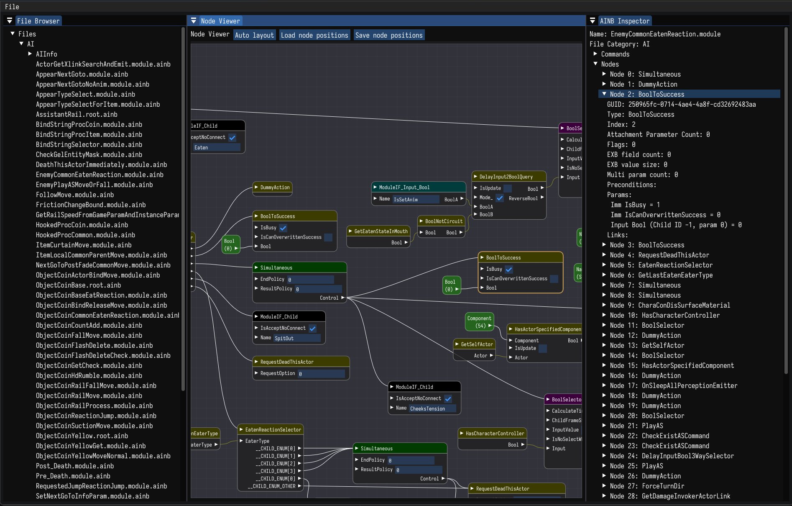

# ainby -  An AINB file viewer

A tool to view `.ainb` files, as seen in Super Mario Bros. Wonder, Tears of the Kingdom, and more.

**NOTE: This program is still in a very early stage of development. Expect bugs, crashes, and incorrect parsing of files.**

## Current features

- Can read most sections of `.ainb` files
- Can view SARC files (e.g. `.pack` files use this)

## Building

0. (Prerequisites) Install CMake and any compatible C++ toolchain
1. Clone the repository: `git clone --recurse-submodules https://github.com/RootCubed/ainby.git`
2. `cd` into the project: `cd ainby`
3. Make a build folder (`mkdir build`) and `cd` into it: `cd build`
4. Configure CMake: `cmake ..`
5. Build the executable: `cmake --build .`
